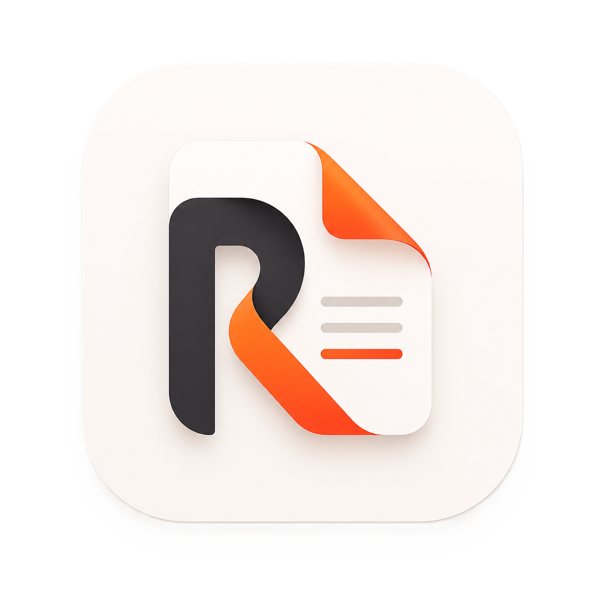

  

<h1 align="center">Rekha Releases</h1>

Official signed Android builds for Rekha PDF Workspace.

  <a href="https://github.com/BiswasSekhar/Rekha-releases/releases/latest">Download the latest release</a>
  ·
  <a href="https://rekha-product.pages.dev/">Product website</a>

## Download

Use the APK that matches the device architecture. Most current Android phones use **arm64-v8a**.

| Architecture | Intended device | Download |
| --- | --- | --- |
| arm64-v8a | Most modern Android phones and tablets | [Latest arm64 APK](https://github.com/BiswasSekhar/Rekha-releases/releases/latest) |
| armeabi-v7a | Older 32-bit ARM devices | [Latest armeabi APK](https://github.com/BiswasSekhar/Rekha-releases/releases/latest) |
| x86_64 | Android emulators and compatible x86 devices | [Latest x86_64 APK](https://github.com/BiswasSekhar/Rekha-releases/releases/latest) |

Open the latest release, choose the matching APK, and verify its SHA-256 checksum from `SHA256SUMS.txt` before installing.

## Install

1. Download the APK for the device.
2. Allow installation from the browser or file manager when Android asks.
3. Open the APK and complete installation.

If Android reports that the signatures do not match, uninstall an older build signed with a different key before installing the official release. Export or back up any local app data first.

## What this repository contains

This is a **release-only repository**. It contains release notes, the Rekha logo, and signed Android release assets. Application source code, build configuration, API credentials, signing keys, and backend code are not stored here.

For support, email [rekha.app.support@gmail.com](mailto:rekha.app.support@gmail.com).

Read the current [Terms of Service and Privacy Policy](https://rekha-product.pages.dev/legal) before using online or AI-assisted features.
